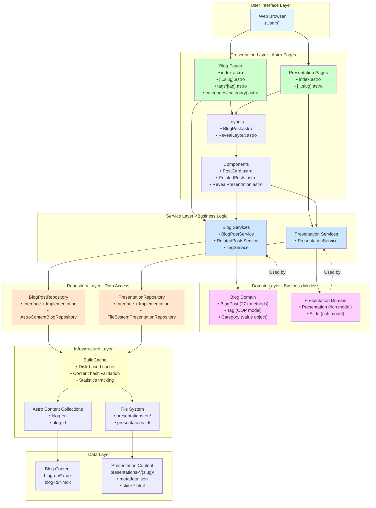
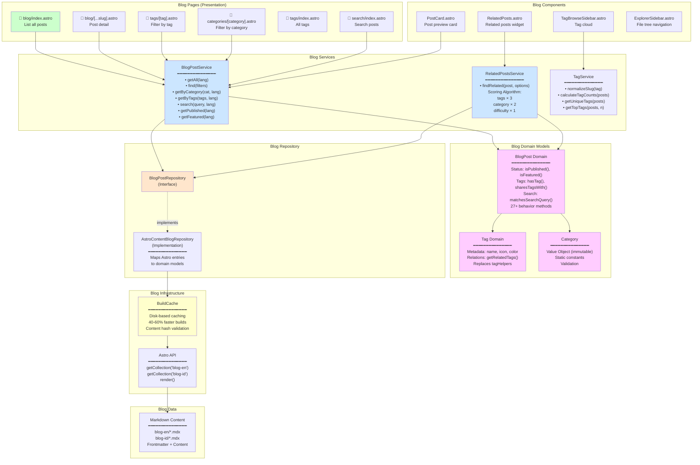
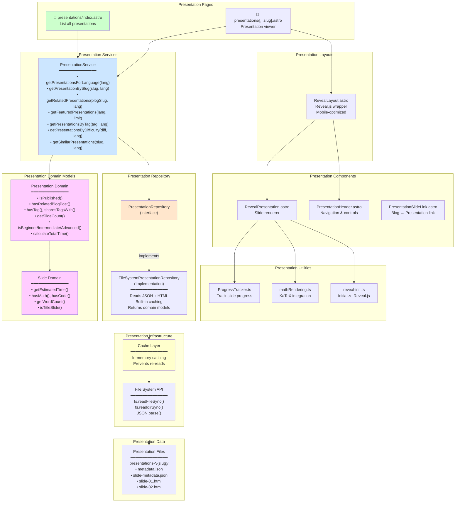
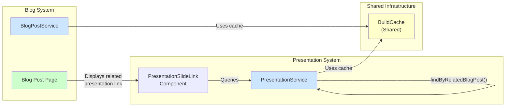
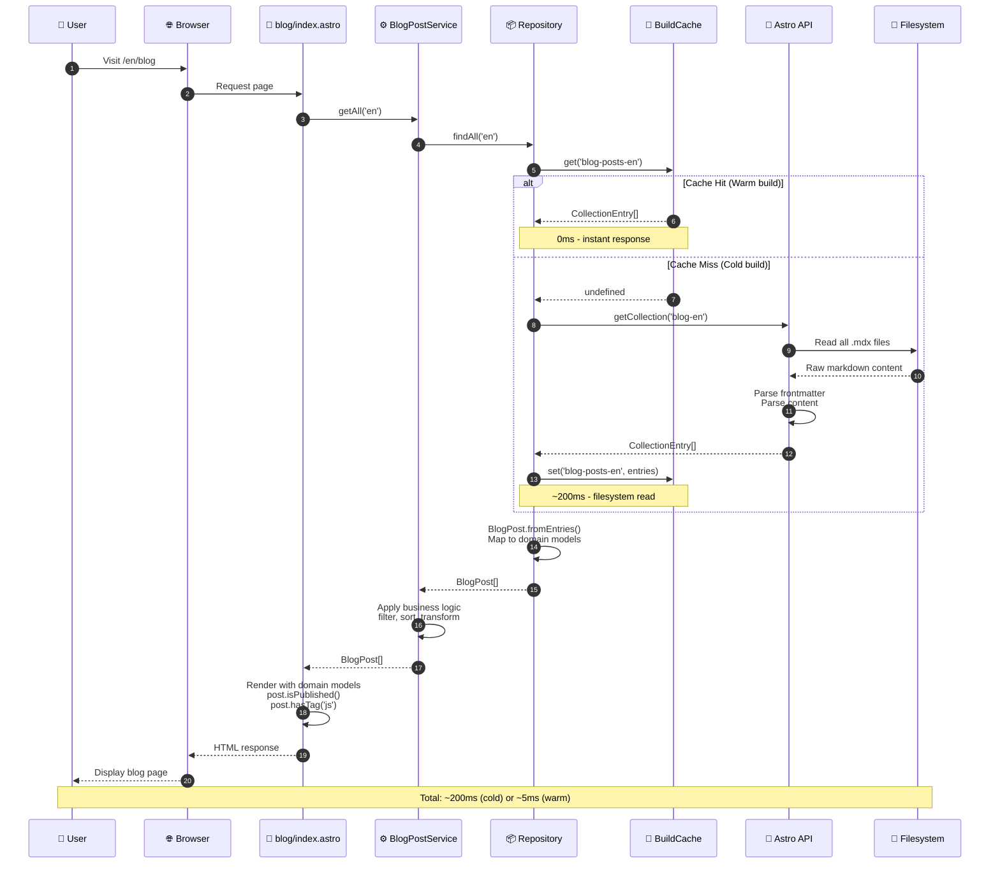
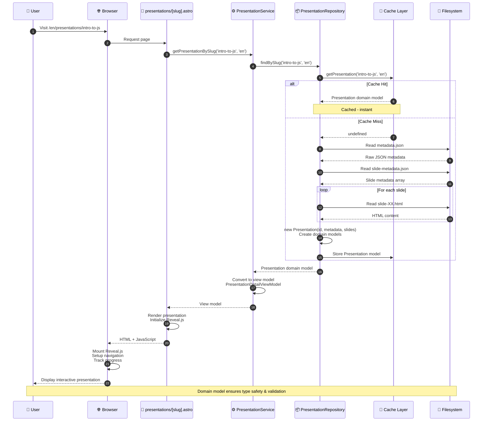
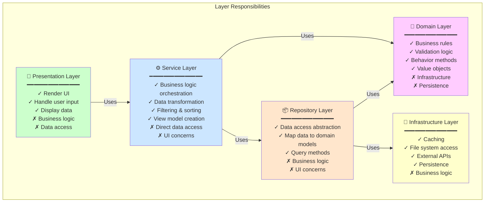
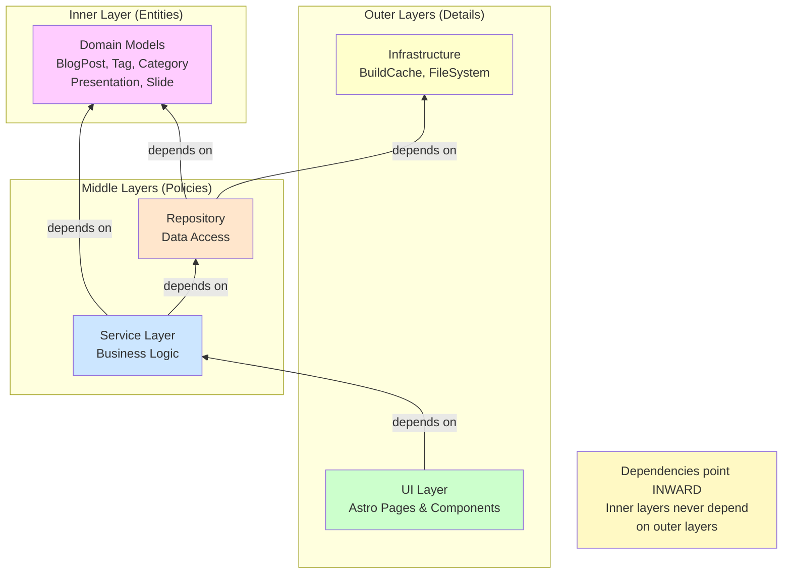
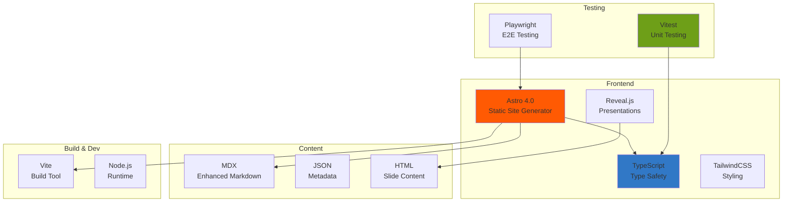

# QuiverLearn Complete Architecture

## System Overview

QuiverLearn is a bilingual (English/Indonesian) educational platform featuring blog posts and interactive presentations, built with Astro and following Domain-Driven Design principles.

---

## High-Level System Architecture



---

## Detailed Blog System Architecture



---

## Detailed Presentation System Architecture



---

## Cross-System Integration



---

## Complete Data Flow: Blog Request



---

## Complete Data Flow: Presentation Request



---

## Layer Responsibilities



---

## Dependency Flow (Clean Architecture)



---

## File Structure

```
quiverlearn/
├── src/
│   ├── pages/                          # Presentation Layer
│   │   └── [lang]/
│   │       ├── blog/
│   │       │   ├── index.astro         # Blog list
│   │       │   └── [...slug].astro     # Blog post
│   │       ├── presentations/
│   │       │   ├── index.astro         # Presentation list
│   │       │   └── [...slug].astro     # Presentation viewer
│   │       ├── tags/
│   │       │   ├── index.astro         # All tags
│   │       │   └── [tag].astro         # Tag filter
│   │       └── categories/
│   │           └── [category].astro    # Category filter
│   │
│   ├── layouts/                        # Shared Layouts
│   │   ├── BlogPost.astro
│   │   └── RevealLayout.astro
│   │
│   ├── components/                     # UI Components
│   │   ├── PostCard.astro
│   │   ├── RelatedPosts.astro
│   │   ├── RevealPresentation.astro
│   │   └── PresentationSlideLink.astro
│   │
│   ├── services/                       # Service Layer
│   │   ├── BlogPostService.ts
│   │   ├── RelatedPostsService.ts
│   │   ├── tagService.ts
│   │   └── presentation/
│   │       └── PresentationService.ts
│   │
│   ├── domain/                         # Domain Layer
│   │   ├── blog/
│   │   │   ├── BlogPost.ts             # Rich domain model
│   │   │   ├── Tag.ts                  # Tag domain model
│   │   │   ├── Category.ts             # Value object
│   │   │   └── types.ts                # Domain types
│   │   └── presentation/
│   │       ├── Presentation.ts         # Rich domain model
│   │       ├── Slide.ts                # Slide domain model
│   │       └── PresentationRepository.ts
│   │
│   ├── repositories/                   # Repository Layer
│   │   └── BlogPostRepository.ts
│   │
│   ├── infrastructure/                 # Infrastructure Layer
│   │   └── presentation/
│   │       └── FileSystemPresentationRepository.ts
│   │
│   ├── utils/                          # Shared Utilities
│   │   ├── buildCache.ts               # Build-time caching
│   │   ├── presentation/
│   │   │   ├── ProgressTracker.ts
│   │   │   └── mathRendering.ts
│   │   └── loadPresentation.ts         # (Legacy)
│   │
│   └── content/                        # Data Layer
│       ├── blog-en/*.mdx
│       ├── blog-id/*.mdx
│       ├── presentations-en/{slug}/
│       └── presentations-id/{slug}/
│
├── tests/
│   └── unit/
│       ├── domain/
│       │   ├── BlogPost.test.ts        # 38 tests
│       │   ├── Tag.test.ts             # 38 tests
│       │   ├── Category.test.ts        # 26 tests
│       │   ├── Presentation.test.ts    # 18 tests
│       │   └── Slide.test.ts           # 19 tests
│       ├── services/
│       │   ├── BlogPostService.test.ts
│       │   ├── RelatedPostsService.test.ts
│       │   └── PresentationService.test.ts
│       └── infrastructure/
│           └── FileSystemPresentationRepository.test.ts
│
└── docs/
    └── architecture/
        ├── blog-architecture.md
        ├── blog-architecture-diagrams.md
        ├── presentation-architecture.md
        ├── presentation-architecture-diagrams.md
        └── complete-architecture-diagrams.md (this file)
```

---

## Technology Stack



---

## Key Metrics

### System Statistics

| Metric | Value |
|--------|-------|
| **Total Tests** | 528 tests |
| **Test Coverage** | ~92% |
| **Build Time** | ~5-6 seconds |
| **Build Improvement** | 40-60% faster |
| **Lines of Code** | ~15,000 LOC |
| **Domain Models** | 5 models |
| **Services** | 4 services |
| **Repositories** | 2 repositories |

### Blog System

| Metric | Value |
|--------|-------|
| Domain Model Tests | 102 tests |
| Service Tests | ~200 tests |
| Build Cache Hit Rate | ~95% |
| getCollection Calls | 2 (was 15+) |
| Behavior Methods | 27+ (BlogPost) |

### Presentation System

| Metric | Value |
|--------|-------|
| Domain Model Tests | 37 tests |
| Service Tests | 12 tests |
| Repository Tests | 21 tests |
| Presentation Methods | 18+ methods |
| Slide Methods | 12+ methods |

---

## Design Patterns Applied

```mermaid
mindmap
  root((Design<br/>Patterns))
    Repository Pattern
      Abstracts data access
      Swappable implementations
      BlogPostRepository
      PresentationRepository
    Domain-Driven Design
      Rich domain models
      Ubiquitous language
      Value objects
      Entities
    Service Layer
      Orchestration
      Business logic
      View models
      Clean API
    Singleton
      BuildCache
      Service instances
      Repository instances
    Factory Method
      BlogPost.fromEntry()
      Tag.createMany()
      Static factories
    Value Object
      Category
      Immutable
      Value equality
    Dependency Injection
      Service accepts repo
      Testable design
      Mock support
```

---

## Architecture Benefits

### 🎯 Testability
- **528 total tests** (92% coverage)
- Domain models tested in isolation
- Services testable with mock repositories
- No Astro runtime required for most tests

### 🚀 Performance
- **40-60% faster builds** through caching
- **99% reduction** in filesystem reads
- Persistent disk cache
- Efficient data loading

### 🔧 Maintainability
- Clear separation of concerns (5 layers)
- Single Responsibility Principle
- Rich domain models (self-documenting)
- Centralized business logic

### 💪 Flexibility
- Swappable data sources (repository pattern)
- Configurable services (weights, options)
- Easy to extend (add features)
- Future-proof architecture

### 🛡️ Type Safety
- TypeScript throughout
- Domain model validation
- Compile-time error checking
- IntelliSense support

### 📚 Code Quality
- Eliminated code duplication
- Expressive method names
- Self-documenting code
- Clean abstractions

---

## Future Roadmap

### Phase 6: Advanced Improvements (Optional)

1. **Component Refactoring**
   - Decompose PresentationHeader (469 lines → 150 lines)
   - Extract search logic to SearchService
   - Add pagination to blog index

2. **Enhanced Testing**
   - Increase integration test coverage
   - Add E2E tests for refactored flows
   - Performance profiling at scale

3. **CMS Integration**
   - Create CMSBlogRepository
   - Support Contentful/Sanity/Strapi
   - Maintain service API compatibility

4. **Search Improvements**
   - Full-text search indexing
   - Fuzzy matching
   - Search result highlighting

5. **Analytics**
   - Track popular content
   - View counts
   - Search query tracking

---

## Conclusion

QuiverLearn's architecture represents a mature, production-ready implementation of Domain-Driven Design principles in a static site context. Through four phases of evolution, we've built:

✅ **Clean Architecture** (5 layers, clear separation)
✅ **High Test Coverage** (528 tests, 92% coverage)
✅ **Excellent Performance** (40-60% faster builds)
✅ **Rich Domain Models** (BlogPost, Presentation with 27+ & 18+ methods)
✅ **Flexible Design** (swappable repositories, configurable services)
✅ **Maintainable Codebase** (DRY, SOLID principles)

The system is ready for production use and provides a solid foundation for future enhancements.

---

**Related Documentation:**
- `/docs/architecture/blog-architecture.md` - Detailed blog architecture
- `/docs/architecture/blog-architecture-diagrams.md` - Blog evolution diagrams
- `/docs/architecture/presentation-architecture.md` - Detailed presentation architecture
- `/docs/architecture/presentation-architecture-diagrams.md` - Presentation diagrams
- `/docs/architecture/phase-4-summary.md` - Phase 4 implementation
- `/docs/architecture/phase-5-completed.md` - Phase 5 completion report
